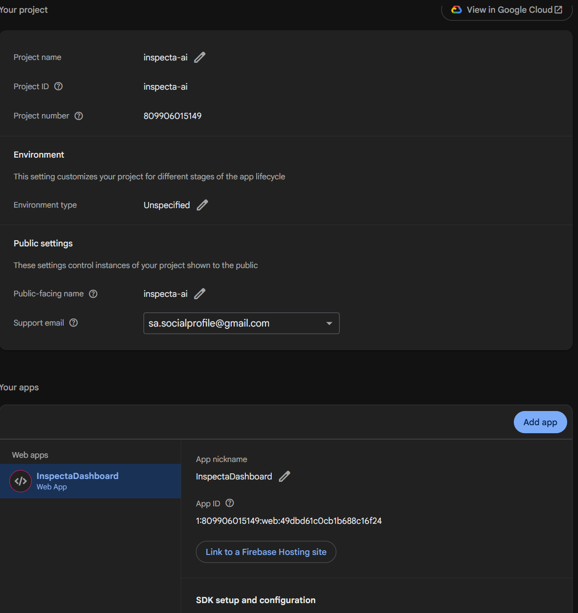

1. created a new project in Firebase: inspecta-ai
	-- unchecked option of running Google Analytics

2. Added authentication of Google (Using Authentication -> SingIn menu option)

3. Add users and make admin settings using Python script
	-- python .\firebaseuser.py --key .\inspecta-ai-firebase-adminsdk-fbsvc-895e11e210.json add  --email sa.socialprofile@gmail.com --company_id 3 --storage_id 3
  
4. Modify Firebase billing plan from Firebase console UI. Change it to Blaze Plan in order to deploy NextJS application. 
  -- Create a new cloud billing account if existing one is not available or suitable

5. Following permissions are needed for firebase-adminsdk-fbsvc@inspecta-ai.iam.gserviceaccount.com service account. Execute following commands to give permissions manually
# 1. Allow the service account to enable APIs:
gcloud projects add-iam-policy-binding inspecta-ai `
  --member="serviceAccount:firebase-adminsdk-fbsvc@inspecta-ai.iam.gserviceaccount.com" `
  --role="roles/serviceusage.serviceUsageAdmin"

# 2. Allow the service account to assign IAM roles:
gcloud projects add-iam-policy-binding inspecta-ai `
  --member="serviceAccount:firebase-adminsdk-fbsvc@inspecta-ai.iam.gserviceaccount.com" `
  --role="roles/resourcemanager.projectIamAdmin"

6. Add following entries in  ..\deployment\cors-config.json under "origin" tag
 "https://inspecta-ai.web.app",
 "https://inspecta-ai.firebaseapp.com",
 
7. Ensure you are in ...\UI\inspecta_dashboard\ folder.  Execute Script
  G:\code\Inspecta\deployment\deploy-ui.ps1 -firebaseprojectid "inspecta-ai" -jsonkeyfile "G:\code\Inspecta\deployment\inspecta-ai-firebase-adminsdk-fbsvc-895e11e210.json" -SkipGcpSetup

8. npx firebase-tools deploy --only hosting --project inspecta-ai

9. Login to Firebase Console, add a new app manually inspecta-ai

